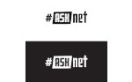

# #ASKtraining training plan

With the #ASKnet training plan you can compile and plan your individual training. You can choose from the different training modules and freely organize the schedule for your training. The training plan automatically creates a schedule with recommended breaks, which are then individually adjusted.


Afterwards, the training plan shows which resources are needed, how high the material costs are, how high the recommended number of participants should be and how many trainers are needed.

You can also add helpful attachments to your training plan, such as a timetable, material checklists, and more. Your individual training plan is ready, which you can then download as a PDF package to share or print out.

## --===<({   [Here it goes to the training plan](https://asktraining.github.io/Training/)   })>===--

## Documentation

All information on how to use the training plan, install it or create additional modules can be found in the [documentation](https://asktraining.github.io/docs/).

## Developer

Here you can see the [concept paper](https://md.bmen.cc/training-generator)

### Run local

To run the training plan locally, the following are required:

- docker >~ v.20.10.3
- docker-compose >~ v.1.27.4
- and an internet connection for the first run

If the requirements are met, all you need to do is check out this Git repository locally and enter the following command in the repository's directory:

```
docker-compose up -d
```
and then go to your browser and type `http://0.0.0.0:4000/Training`

To stop the training plan:
```
docker-compose stop
```
Then you can use the following command to start the training planner at any time without needing an internet connection:
```
docker-compose start
```
## Partners and Funder

| r0g Agency | ASKnet | developed by nanoLogika | BMZ |
| :--------: | :----: | :-------------------------: | :-------: |
|[](https://openculture.agency/)|[](https://github.com/ASKnet-Open-Training)| [](https://www.nanologika.de) | [](https://www.bmz.de/en/) |
| [Official Website](https://openculture.agency/) | [Official Website](https://github.com/ASKnet-Open-Training) | [Official Website](https://www.nanologika.de) | [Official Website](https://www.bmz.de/en/) |

## License

<a rel="license" href="http://creativecommons.org/licenses/by-sa/4.0/"></a><br />All content is licensed under a <a rel="license" href="http://creativecommons.org/licenses/by-sa/4.0/">Creative Commons Attribution-ShareAlike 4.0 International License</a>.

The Configurator Software is licensed under a GPLv3 License (see LICENSE.md File)
